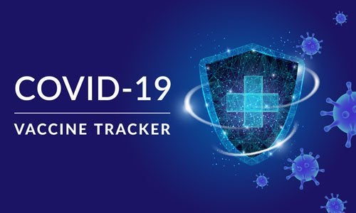

<div align="center"></div>

## Contents

- [Introduction to Script](#introduction)
- [Installation](#installation)
- [Technology Used](#technology-used)
- [Data Cleaning](#data-cleaning)
- [Hypothesis](#hypothesis)
- [Conclusion](#conclusion)
- [Summary](#summary)


# Introduction to Script
The following dashboard shows most recent information on the progress of vaccinations around USA States

# Installation

 1. cd to the directory where requirements.txt is located.
 2. activate your virtualenv
 3. run the following code in your shell to install all the libraries necessary for the application.  
 
  ```python
 pip install -r requirements.txt

To see the dashbaord, run the following code in your shell:

1. Change directories to the inner main dash application
 ```python
cd dash
 ```

2. Run migrations
 ```python
python manage.py migrate
 ```

 3. Run django Application
 ```python
python manage.py runserver
 ```

## Tbi

Aim:

<br>

## Technology Stack
In this analysis, we used python as the primary programming language because of its rich palette of tools that make data analysis a cinch. Some of the packages we used are
| Library | Description |
| --- | --- |
| [Matplotlib](https://matplotlib.org/) | Matplotlib is an extremely versatile library of tools for generating interactive plots that are easy to interpret and customise. |
| [Numpy](https://github.com/numpy/numpy) | Numpy is a popular library used for array manipulation and vector operations. It is used extensively across python projects that require scientific computing. |
| [Pandas](https://pandas.pydata.org/pandas-docs/stable/user_guide/10min.html) | Pamdas is another library for data science that is just as popular as numpy. It provides easy to use data structures and functions to manipulate structured data. |
| [Seaborn](https://seaborn.pydata.org/) | Seaborn is a Python data visualization library based on matplotlib. It provides a high-level interface for drawing attractive and informative statistical graphics. |
| [Sqlite3](https://www.sqlite.org/index.html) | Sqlite3 is a C library that provides a lightweight disk-based database that allows accessing the database using a nonstandard variant of the SQL query language. |

## Data Cleaning

The most important step to take before we get started geenrating any kind of information from all these data sources, it is first important to clean our data and make sure that the datasets are compatible with each other. Since most of the data is divided on a host id basis, we must make sure that all the rows have values and cantain the same formatting.

# Data Engineering

#### Conclusion¶
Tbi

## About us
| Preview                                                                                                                                                                                                                                     | Description                                                                                                                                                                                                                                                  |
| ------------------------------------------------------------------------------------------------------------------------------------------------------------------------------------------------------------------------------------------- | ------------------------------------------------------------------------------------------------------------------------------------------------------------------------------------------------------------------------------------------------------------ |
| [](https://i.imgur.com/0OoLaa5.png)                                                                                                                                                | Clariza is an Ambitious data science fellow committed to academic excellence. Prepared to implement diverse skill sets, technical proficiencies and new perspectives to leadership personnel. Adaptable and driven with strong work ethic and ability to thrive in team-based or individually motivated settings. At her core, she is a problem solver and experimenter who’s passionate about using sociological and data driven approaches to tackling projects and building meaningful products that help people live better lives. She has worked in Medical billing, consumer and customer service and is now looking to pivot her career path towards Data Science.                                                                                    |
| [](https://i.imgur.com/0OoLaa5.png)                                                                                                                                                | Stanislava is a life-long learner with a background in Marketing and a passion for Cybersecurity & Data. Team-focused, resourceful, and detail-oriented with a successful record of over 7 years of client-facing experience. Seeking to effectively bridge the gap between Engineering and Business Teams, along with the capability of rendering excellent technical and communications skills.|
| [](https://s3.amazonaws.com/assets.datacamp.com/blog_assets/DataScienceEightSteps_Full.png)                    | Hi! My name is Janet Perez and I have a passion and interest in pursuing a career at the intersection of data science and biology. I am a college graduate from Binghamton University where I obtained my Bachelor's in math and biology. I am currently a data science fellow at The Knowledge House, a nonprofit organization focused on training people to pursue careers in the tech sector. I want to combine the technical skills I am developing at The Knowledge House with my background in math and the sciences to get into a career within a team where I can build professional relationships and collectively tackle biological problems that can make a difference in people’s lives.              |